###################
TestDumbways
###################

Berikut Merupakan Penjelasan Dari Soal Yang Diberikan.

*******************
Soal 1
*******************

Menetukan JumLah Dari String Huruf Vokal yang diInput
****************************************************
Soal 2
*******************
Menhitung Total Harga Barang A=3000 jika pembelian 10 diskon -500
                             B=3500 Jika Pembelian 5 diskon 50%
                             C=5000 Tidak Ada Promo  
**************************
Soal 5
**************************
Aplikasi Pendukung
-Web Sever (XAMPP)
-PHP
-SQL

Instalasi
- Buat Database dbmusik
- Import SQL athor.sql Kedalam Database dbmusik
- Import content.sql Kedalam Database dbmusik
- Import course.sql Kedalam Database dbmusik
- Jalankan Website

***********************
Screen Shoot Aplikasi
**********************
Tampilan SQL Database 
*******************************
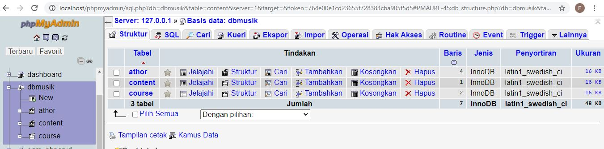
*******************************
Tampilan SQL Table Course
*********************************
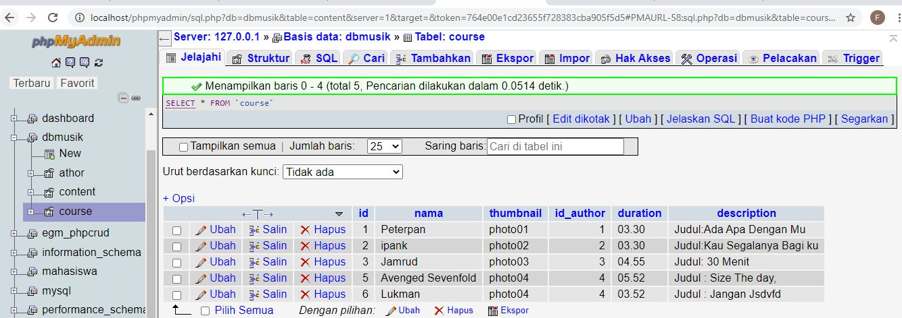
*********************************
Tampilan SQL Table Content
**************************
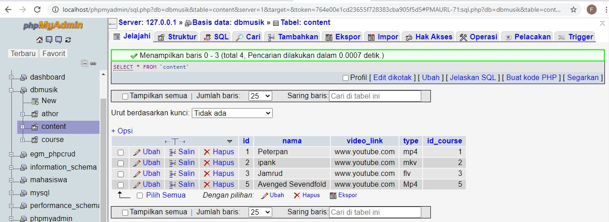
**********************************
Tampilan SQL Table Athor
**************************
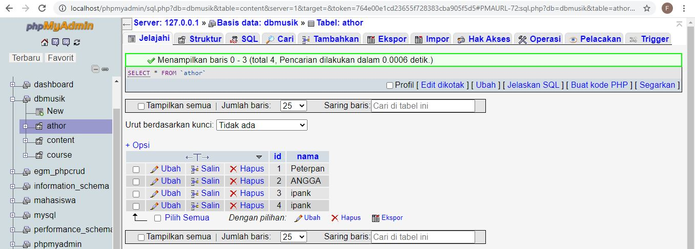
*******************************

Tampilan HOME Course (View)
***************************
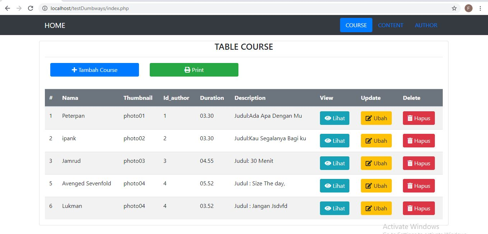
*******************************
Tampilan Insert Course
**************************
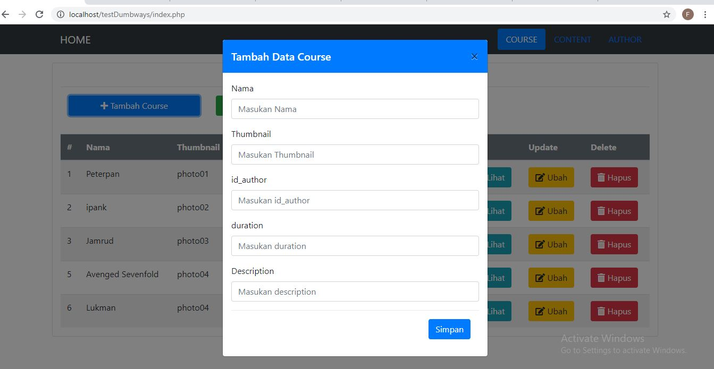
************************************
Tampilan view Course
************************
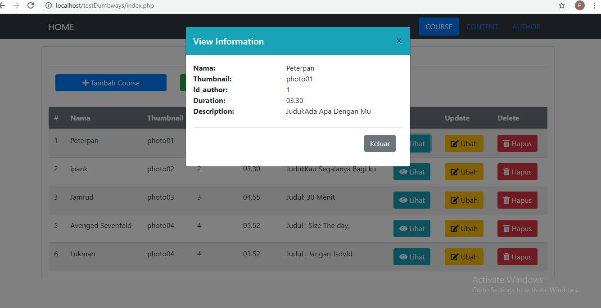
*******************************
Tampilan Edit
**************************
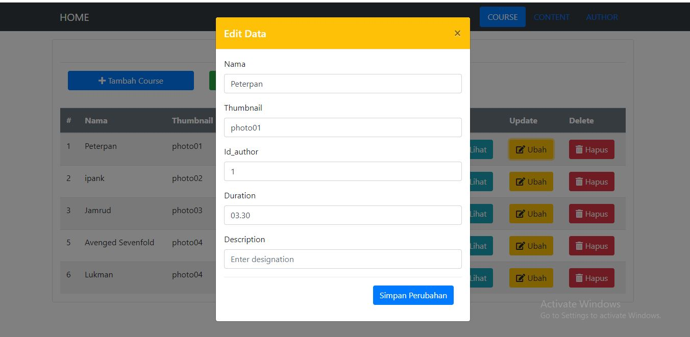
*************************************
Tampilan Delete Course
*************************
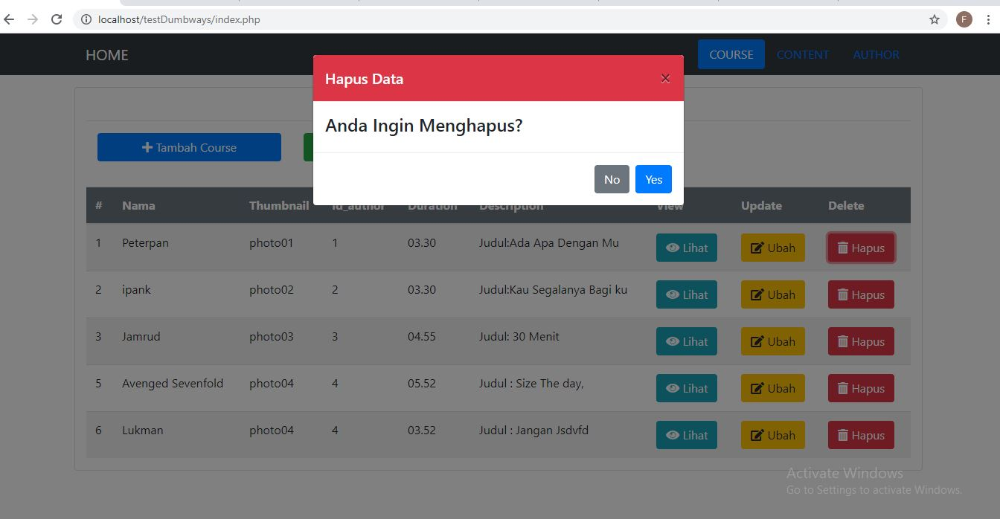
*****************************************

Tampilan HOME Content (View)
****************************************
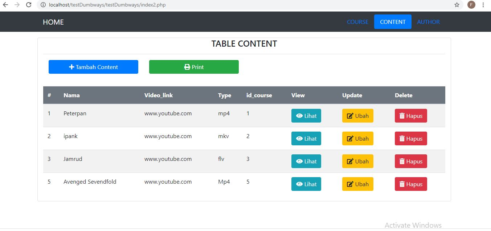
*******************************
Tampilan Insert Content
**************************
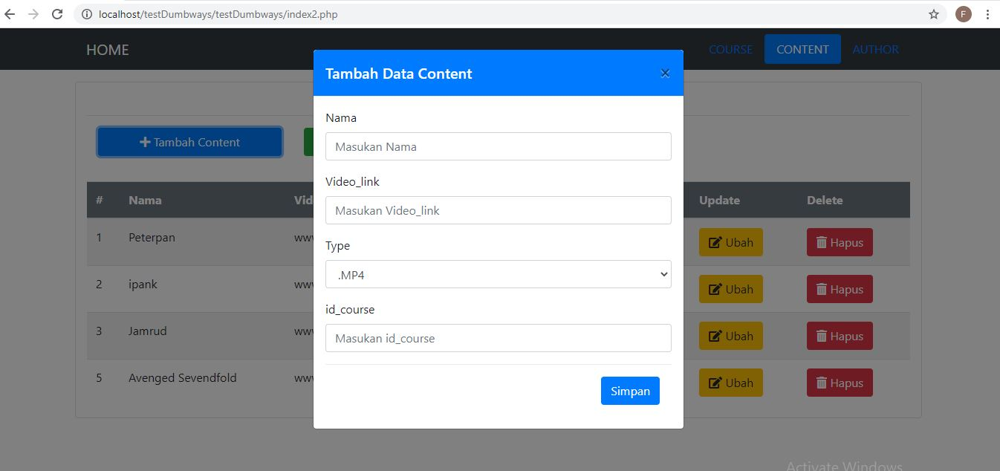
************************************
Tampilan view Content
************************
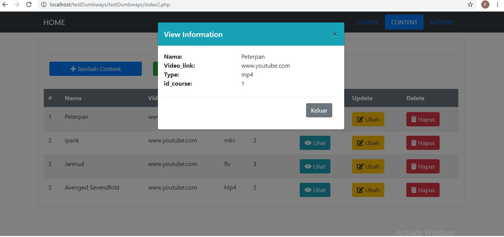
********************************
Tampilan Edit Content
**************************
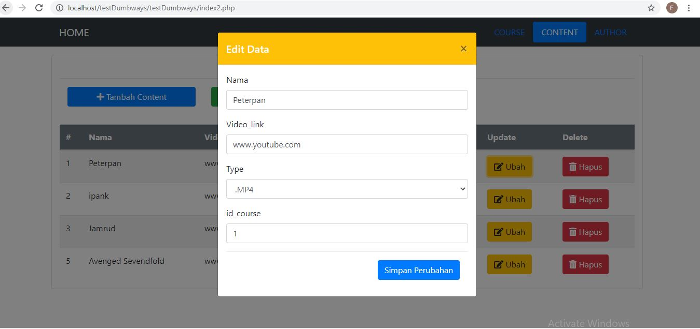
***********************************
Tampilan Delete Content
*************************

*************************************